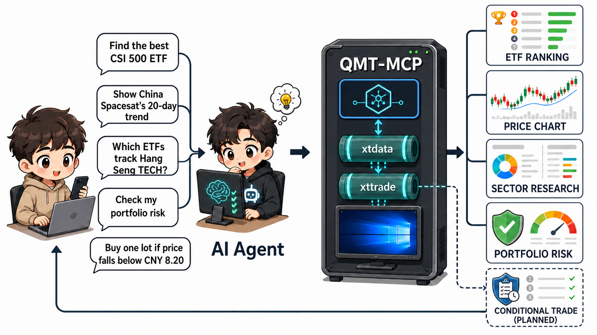

# qmt-mcp · Connect QMT to AI agents over MCP

🌐 [简体中文](README.md) · **English**

[](https://github.com/juju-w/qmt-mcp/actions/workflows/ci.yml)
[](https://github.com/juju-w/qmt-mcp/actions/workflows/release.yml)
[](LICENSE)
[](#)
[](https://github.com/juju-w/qmt-mcp/pkgs/container/qmt-mcp)
[](CONTRIBUTING.md)
[](https://github.com/juju-w/qmt-mcp/stargazers)

Expose the Windows **QMT / MiniQMT terminal** to AI agents over **MCP (Model
Context Protocol)**. On Windows x64, the native desktop launcher discovers and
supervises QMT without Docker or a system Python/.NET install. On Linux/NAS, the
Docker appliance runs broker-neutral, isolated Wine instances.

> **Core idea**: the base image is **broker-agnostic** — switch brokers by swapping
> a mounted **broker pack**, never by rebuilding. One host can run several brokers
> in parallel.

<p align="center">
  
</p>
<p align="center"><sub>xtdata scenarios are available today; xttrade account and portfolio queries require broker permission, while conditional trading remains a planned extension.</sub></p>

```text
immutable base image  ghcr.io/juju-w/qmt-mcp           mounted at runtime
(Wine wow64 + Win Python 3.12 + MCP + xrdp)  ◄── broker pack → /broker
— broker-neutral, ships NO terminal/xtquant/account data   (QMT terminal + xtquant + broker.yaml)
```

## Screenshots

| Stock snapshot | Sector board | QMT terminal in Docker (RDP) |
|:---:|:---:|:---:|
|  |  |  |

## Status

| Capability | State | Notes |
|---|---|---|
| Native Windows launcher | ✅ ready | no Docker/system Python/.NET; QMT discovery, tray supervision, DPAPI token, ZIP/setup releases |
| Persistent QMT desktop + RDP/VNC | ✅ | terminal + MCP start at boot; RDP and optional VNC share one session |
| Market data `xtdata` (snapshot/bars/instruments/sectors/calendar) | ✅ ready | MCP tools return structured JSON (11/11 verified live) |
| **Fuzzy instrument search** (name/pinyin/alias/sector/theme) | ✅ ready | the agent locates instruments without knowing QMT codes |
| Read-only account queries `xttrade` | ⚠️ needs broker permission | degrades to `not_authorized` (no crash) when not enabled |
| Database persistence (PostgreSQL, optional) | ✅ ready | market-data warehouse, read/write-through, off by default |
| `qmtctl` CLI | ✅ ready | compiled Go CLI client for health/search/quotes/account queries |
| MCP protocol | ✅ dual-era | prefers stable `2026-07-28`; the same `/mcp` endpoint accepts 2025 clients |
| MCP durable tasks | ✅ ready | persistent lifecycle, explicit input, optional status push, and polling fallback |
| MCP contracts / profiles | ✅ ready | structured results and behavior hints; full/readonly/market/account/core/custom surfaces |
| OAuth 2.1 authorization | ✅ ready | static/oauth/hybrid, JWT/JWKS validation, scoped tools, qmtctl PKCE login and refresh |

> **Trading/account permission**: connecting `xtquant` to the trading interface
> (orders **and** account queries) requires the broker to enable "programmatic
> trading / external Python API" permission (`m_nPythonConnectNet`). Without it,
> only market data works. Enabling usually needs an asset threshold + a signed
> agreement — contact your broker.

## MCP tools

✨ **Highlight: fuzzy instrument search** — the agent doesn't need the QMT code up
front; it searches by Chinese name / pinyin initials / alias / sector / theme
(e.g. `天岳`, `ZGWX`, `恒生科技`, `纳指`), resolves a code, then fetches quotes.

| Tool | What it does |
|---|---|
| `qmt_health` · `qmt_capabilities` | health / capability state (auth, deps, tool families) |
| `qmt_xtdata_search_instruments` ✨ | **fuzzy-search** instruments by name/code/alias/pinyin/sector/theme, ranked by relevance + liquidity |
| `qmt_xtdata_resolve_instrument` ✨ | **resolve** a phrase to the best code + alternates (`resolved=false` when low-confidence) |
| `qmt_xtdata_search_sectors` | fuzzy-search sector names |
| `qmt_xtdata_instrument_detail` | metadata for one instrument |
| `qmt_xtdata_snapshot` | real-time snapshot (last price / bid-ask / …) |
| `qmt_xtdata_bars` | OHLC bars (tick / minute / day / week / month…) |
| `qmt_xtdata_sector_list` · `qmt_xtdata_sector_constituents` | sector list / constituents |
| `qmt_xtdata_index_weight` | index weights |
| `qmt_xtdata_trading_dates` · `qmt_xtdata_trading_calendar` · `qmt_xtdata_holidays` | trading calendar |
| `qmt_xtdata_download_history` · `_batch` | download history to local cache |
| `qmt_xtdata_instrument_cache_status` · `qmt_xtdata_refresh_instrument_cache` | search-cache status / refresh |
| `qmt_xtdata_quote_subscribe` · `qmt_xtdata_quote_unsubscribe` · `qmt_xtdata_quote_subscriptions` · `qmt_xtdata_quote_subscription_status` | quote subscription hot cache (`subscribe_quote` first, bounded polling fallback) |
| `qmt_xtdata_option_chain` · `qmt_xtdata_option_quotes` · `qmt_xtdata_option_iv` · `qmt_xtdata_volatility_index_inputs` | option chains, call/put quotes, IV, and VIX input packages (read-only; no index publishing) |
| `qmt_xtdata_financial_data` · `qmt_xtdata_ipo_info` · `qmt_xtdata_dividend_factors` · `qmt_xtdata_cb_info` · `qmt_xtdata_etf_info` | financial/IPO/dividend/CB/ETF reference data (read-only, capability-gated) |
| `qmt_portfolio_summary` · `qmt_portfolio_positions` · `qmt_portfolio_exposure` · `qmt_portfolio_risk_checks` | portfolio holdings/exposure/risk metrics (read-only, xttrade allowlist required) |
| `qmt_xtdata_sector_create` · `qmt_xtdata_sector_add_codes` · `qmt_xtdata_sector_remove_codes` · `qmt_xtdata_managed_sector_list` | custom sector management (off by default; managed prefixes only) |
| `qmt_xtdata_formula_call` · `qmt_xtdata_formula_call_batch` · `qmt_xtdata_formula_generate_factor` · `qmt_xtdata_formula_subscribe` | formula/factor runtime (off by default; server allowlist + output sandbox) |
| Account read-only `xttrade` (04, **opt-in**) | see table below, off by default |

**xttrade account-query tools** (require `QMT_ENABLE_XTTRADE_QUERY=1` + account allowlist):

| Tool | What it does |
|---|---|
| `qmt_xttrade_asset` | cash/total/market-value/frozen asset snapshot |
| `qmt_xttrade_positions` | holdings (code, volume, can-use/frozen/yesterday/on-road, open/avg price, market value) |
| `qmt_xttrade_orders` | today's orders (with `cancelable_only` filter) |
| `qmt_xttrade_trades` | today's fills (code, price, volume, amount, time, order id) |
| `qmt_xttrade_position_statistics` | aggregate position statistics |
| `qmt_xttrade_account_status` | trading account status |
| `qmt_xttrade_new_purchase_limit` | new-share (IPO) purchase limits |
| `qmt_xttrade_ipo_data` | today's IPO/new-issue data (not account-scoped) |

All trading and account tools are **read-only**, authenticated, audited, and
return structured JSON (no order/cancel/transfer tools). Managed sectors and
formula output are non-trading mutations that are off by default and require
explicit feature gates, a namespace/sandbox, and OAuth `qmt:manage`.

> **Account queries (feature 04)** are off by default; enable with
> `QMT_ENABLE_XTTRADE_QUERY=1` **and** an account allowlist `QMT_TRADE_ACCOUNTS`,
> and the broker must have granted programmatic-trading permission for the success
> paths (otherwise `not_authorized`, gracefully). **Strictly read-only, no order/cancel/transfer**.
> Success paths await a permissioned account (PRs welcome).

### Tool contracts and profiles

Every visible tool publishes a title, input/output JSON Schema, and read-only,
destructive, idempotent, and open-world behavior hints. Modern clients consume
`structuredContent`; legacy clients retain an equivalent JSON text block.
Schema validation does not add or remove business fields.

The default `full` profile preserves the complete surface. Narrow one agent's
context and callable capabilities in `appliance/.env`:

```env
QMT_MCP_TOOL_PROFILE=market
QMT_MCP_TOOL_ALLOWLIST=qmt_xtdata_snapshot,qmt_xtdata_option_*
QMT_MCP_TOOL_DENYLIST=qmt_xtdata_download_*
```

Profiles are `full`, `readonly`, `market`, `account`, `core`, and `custom`;
`custom` requires an allowlist. The profile and shell globs are fixed at process
startup, so restart the container after changing them. In OAuth mode this
surface is intersected with token scopes; even `qmt:admin` cannot bypass a
startup profile or feature gate.

### Tool pagination and HTTP compression

`tools/list` returns at most 50 authorized tools per page by default and uses a
standard opaque cursor for continuation. Profiles, allow/deny rules, and OAuth
scopes are applied before cursor creation. qmtctl automatically consumes every
page, so `qmtctl tools` usage and output remain unchanged. This paginates the
MCP catalog; it does not change any market, option, or reference tool's own
`limit`.

Remote MCP JSON responses are compressed when the client accepts gzip and the
body is at least 1024 bytes. SSE is never compressed. Tune the defaults in
`appliance/.env`, or set the threshold to `0` when a reverse proxy owns
compression:

```env
QMT_MCP_LIST_PAGE_SIZE=50
QMT_MCP_GZIP_MIN_SIZE=1024
```

### Durable MCP Tasks

Stable `2026-07-28` clients that declare
`io.modelcontextprotocol/tasks` receive durable handles for selected long
operations. Supported 2025 clients and modern clients that do not declare the
extension keep synchronous `tools/call` behavior on the same endpoint.

Task state is stored in a bounded SQLite database in the broker pack. It keeps
lifecycle state, owner/scope digests, pending standard `inputRequests`, and
terminal output, but never tool arguments, credentials, or submitted answers.
qmtctl requires explicit `task update` responses and never auto-confirms.

Capable stable clients may opt into status push with
`subscriptions/listen.notifications.taskIds`. The server acknowledges the
accepted IDs, sends current state, and then emits complete
`notifications/tasks` snapshots after committed transitions. Polling with
`tasks/get` remains fully supported. qmtctl tries notifications first and
automatically falls back to server-guided polling on unsupported or lost
streams; both paths share the overall `--task-timeout`.

```bash
qmtctl cache refresh --force
qmtctl --task-mode detach --json cache refresh --force
qmtctl task get tsk_<id>
qmtctl task wait tsk_<id>
qmtctl task cancel tsk_<id>
qmtctl task update tsk_<id> \
  --responses-json '{"confirmation":{"action":"accept","content":{"confirm":true}}}'
```

## Quick start

### Windows x64: no Docker

1. Download `qmt-mcp-launcher_<version>_setup.exe` or the portable ZIP from
   [Releases](https://github.com/juju-w/qmt-mcp/releases).
2. Open QMT-MCP. In **Setup**, select the broker's `XtItClient.exe` or
   `XtMiniQmt.exe`, or choose **Detect client**.
3. Review the resolved `xtquant` and `userdata_mini` paths, save, and choose
   **Start**.
4. Complete the normal interactive broker login. Copy the local MCP connection
   after **Market data** becomes **Ready**.

The launcher binds only to `127.0.0.1` and protects its token with current-user
Windows DPAPI. The release bundles Python 3.12, locked MCP dependencies, and this
project's server source. It does not bundle QMT, `xtquant`, account data, or
credentials, and it does not automate login or trading dialogs. The UI supports
Simplified Chinese and English, defaults from the Windows display language, and
remembers an explicit selection.

### Linux / NAS: Docker appliance

> Must build & run on a **native amd64 host** (Apple Silicon is emulation-only and
> QMT may hit the Rosetta AVX assertion).

```bash
cd appliance
cp .env.example .env                       # fill in authentication / BROKER_PACK / ...
# Keep QMT_DESKTOP_MODE=persistent and set a unique RDP password (12+ chars).
docker compose build                       # build the broker-neutral base image
scripts/make-broker-pack.sh <setup_qmt.exe> <xtquant_xxxxxx.rar> brokers/<id>/pack
docker compose up -d
# Optional saved-credential/mobile VNC access:
# docker compose -f docker-compose.yml -f docker-compose.vnc.yml up -d
```

Connect (the desktop starts with the container; log into your account in QMT
when prompted, and use **independent-trading / minimal** mode for trading):

```text
RDP:  127.0.0.1:13389   wineuser / password in .env
VNC:  127.0.0.1:15900   optional override; clients may retain its credential
MCP:  http://<host>:18765/mcp   with Authorization: Bearer <QMT_MCP_TOKEN>
```

Prefer RDP for desktop performance; enable the VNC override for retained client
credentials or lightweight Android access. Tunnel either port over SSH/VPN.
Both protocols expose the same QMT/Xorg session. Raw VNC is not encrypted and
classic authentication uses only the first eight password characters, so never
publish it directly to the internet.

The default `static` mode is upgrade-compatible. Public or multi-user
deployments can use an external authorization server with `oauth` or `hybrid`;
QMT-MCP remains the resource server and never stores user passwords or issues
tokens. See [client setup](docs/MCP-CLIENTS.md) and
[deployment hardening](appliance/docs/DEPLOY.md).

You can also use the **qmtctl** CLI from the command line (see [`cli/qmtctl/README.md`](cli/qmtctl/README.md)):

```bash
cd cli/qmtctl && go build -o qmtctl .
export QMT_MCP_URL=http://<host>:18765/mcp QMT_MCP_TOKEN=<token>
./qmtctl health                       # health check
./qmtctl search 纳指                   # fuzzy instrument search
./qmtctl snapshot 510300.SH           # real-time quote snapshot
./qmtctl bars 510300.SH --period 1d   # OHLC bars
./qmtctl subscription add --id s1 510300.SH,510500.SH  # quote subscription
./qmtctl portfolio summary --account <id>              # portfolio summary
./qmtctl option chain --family 300ETF                  # option chain
./qmtctl ref financial 600000.SH --tables Income       # reference data
./qmtctl account asset --account <id> # account asset (requires xttrade enabled)
```

In OAuth mode qmtctl can run browser-based PKCE login and securely reuse and
refresh the session:

```bash
./qmtctl --url https://qmt.example.com/mcp auth login \
  --client-id-metadata-url https://client.example.com/qmtctl.json \
  --scope 'qmt:read qmt:market'
./qmtctl --url https://qmt.example.com/mcp auth status
```

More: [broker pack guide](appliance/docs/BROKER-PACK.md) ·
[deploy & hardening](appliance/docs/DEPLOY.md) ·
[Codex / Claude Code / WorkBuddy clients](docs/MCP-CLIENTS.md)

## Requirements

- **Windows mode** — Windows 10 22H2 or Windows 11 x64, with a broker-provided QMT and matching `xtquant`.
- **Docker mode** — native amd64 Linux; don't run production on Apple Silicon (emulation may trigger
  the Rosetta AVX crash).
- **GBK locale** — QMT is a cp936 Chinese program; the image builds the Wine prefix
  with `zh_CN.GBK`.

## Layout & development

```text
appliance/   # deployable appliance: Dockerfile · compose · scripts · mcp/ · brokers/ · docs/
cli/         # qmtctl: compiled Go CLI client (streamable-http MCP)
launcher/    # native Windows x64 desktop launcher, packaging, and installer
skills/      # AI agent ops knowledge base (deploy/MCP/CLI/troubleshooting)
specs/       # Spec-Driven Development (spec-kit): feature specs/plans/tasks
```

Managed with **Spec-Driven Development**, one feature at a time, spec before code.
Principles in [`constitution.md`](.specify/memory/constitution.md); AI-agent map in
[`AGENT.md`](AGENT.md); tests in
[`appliance/mcp/tests/README.md`](appliance/mcp/tests/README.md).

## Versioning and automated releases

Commits and PR titles use `type(scope): description`, for example
`feat(xtdata): add option filters` or `fix(cli): preserve session headers`.
After CI succeeds on `main`, Conventional Commits determine the next SemVer. The
workflow updates `VERSION` and `CHANGELOG.md`, creates the release commit and tag,
then publishes:

- `ghcr.io/juju-w/qmt-mcp:X.Y.Z` and `latest` (appliance: linux/amd64 only)
- qmtctl for Linux, macOS, and Windows on amd64 and arm64
- native Windows x64 launcher ZIP and per-user setup
- `SHA256SUMS` and one GitHub Release

The image uses a persistent BuildKit cache, and MCP source-only changes no longer
reinstall Wine or Windows Python dependencies. An optional mainland China
registry receives the same image digest without a second build. See
[`docs/RELEASE.md`](docs/RELEASE.md) for cache, mirror, and retry configuration,
and [`CONTRIBUTING.md`](CONTRIBUTING.md) for accepted types and bump rules.

## Contributing / Help wanted 🙋

The biggest ask is **feature 04 (read-only account queries via `xttrade`)**:
validating the success paths needs an account with **"programmatic trading /
external Python API" permission** (`m_nPythonConnectNet`), which the maintainer
does not have (below the broker's threshold) — so only the "graceful
not-authorized" path can be tested locally. **If you have a permissioned account,
PRs that help get 04 working are very welcome** — see
[`specs/004`](specs/004-account-query-tools/spec.md).

Other contributions (market-data tools, deployment examples, docs) are welcome
too. See [`CONTRIBUTING.md`](CONTRIBUTING.md); report security issues privately per
[`SECURITY.md`](SECURITY.md).

## Sponsor ☕

Built and maintained in my spare time, fully open-source and free — but it leans
heavily on AI coding assistants (subscriptions aren't cheap 😅). If it helped you,
a coffee toward the AI-subscription cost is hugely appreciated — and a ⭐ Star helps
too! 🙏

| WeChat | Alipay |
|:---:|:---:|
|  |  |

## Acknowledgements / License

- Released under the **MIT License** ([`LICENSE`](LICENSE)).
- Development was greatly accelerated by the AI coding assistants **OpenAI GPT /
  Codex** and **Anthropic Claude (Claude Code)** — thank you 🤖.
- The MCP server is an independent implementation in this repo
  (`appliance/mcp/qmt_mcp_core` + `qmt_mcp_xtdata` + `qmt_mcp_xttrade` + `qmt_mcp_db`).
- Base image built on [`scottyhardy/docker-wine`](https://github.com/scottyhardy/docker-wine).
- The QMT terminal and `xtquant` belong to the respective brokers / Thinktrader and
  are **not included in this repo** — obtain them yourself.
