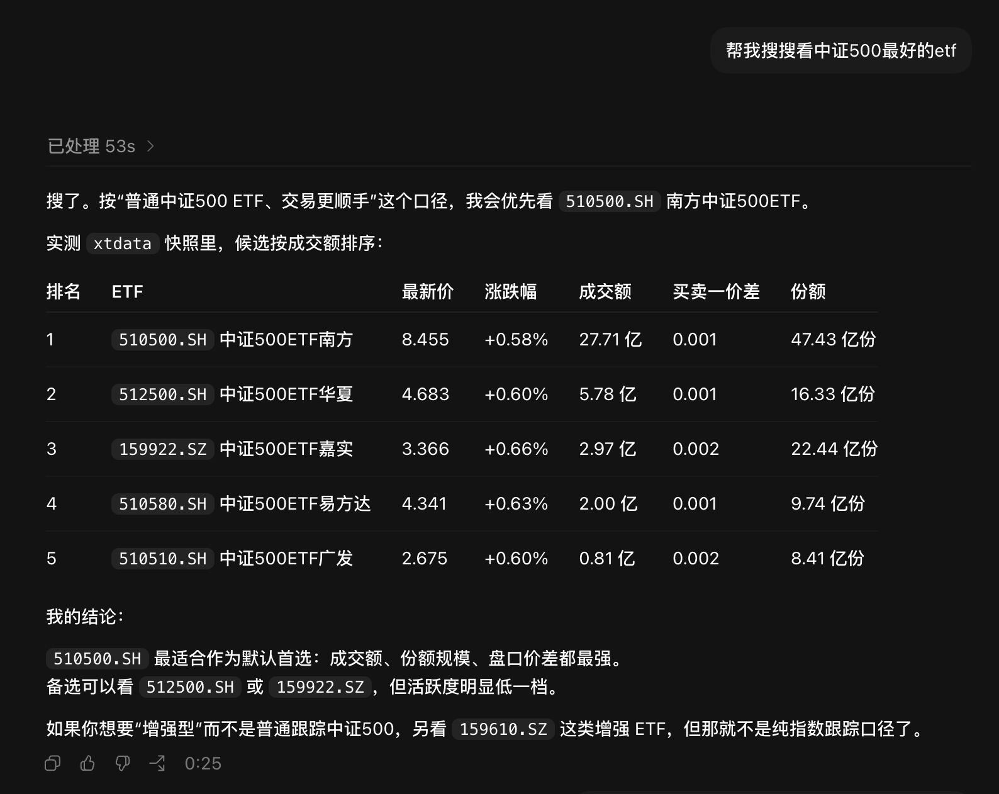
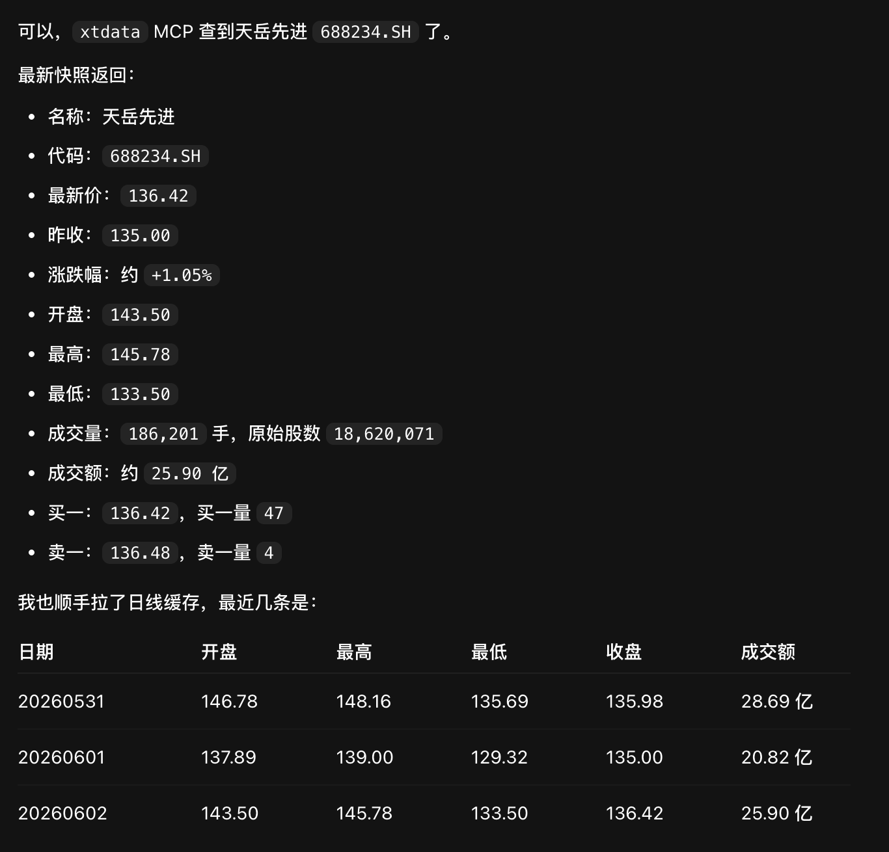
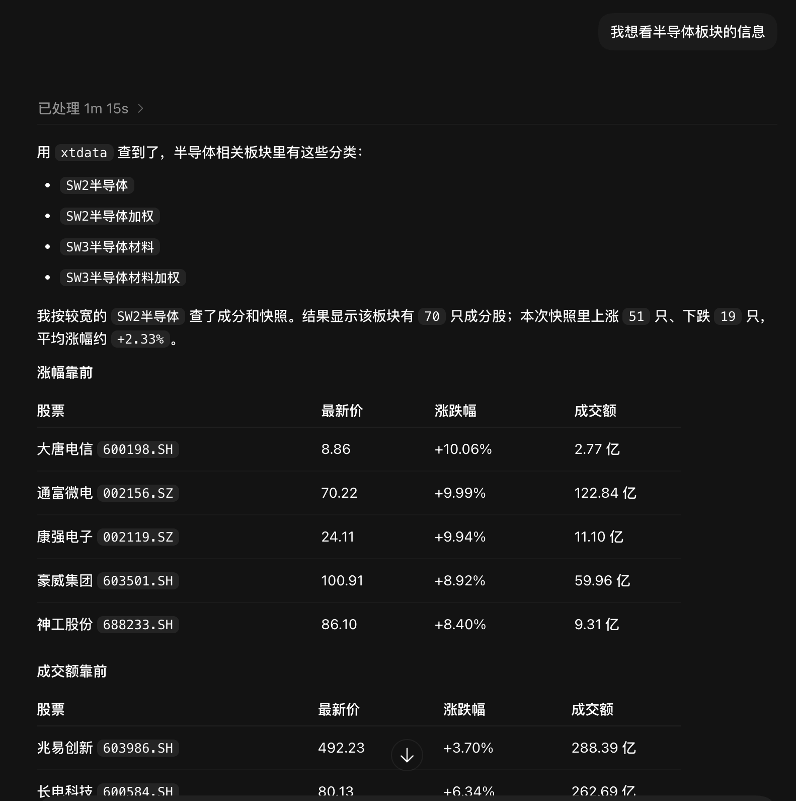
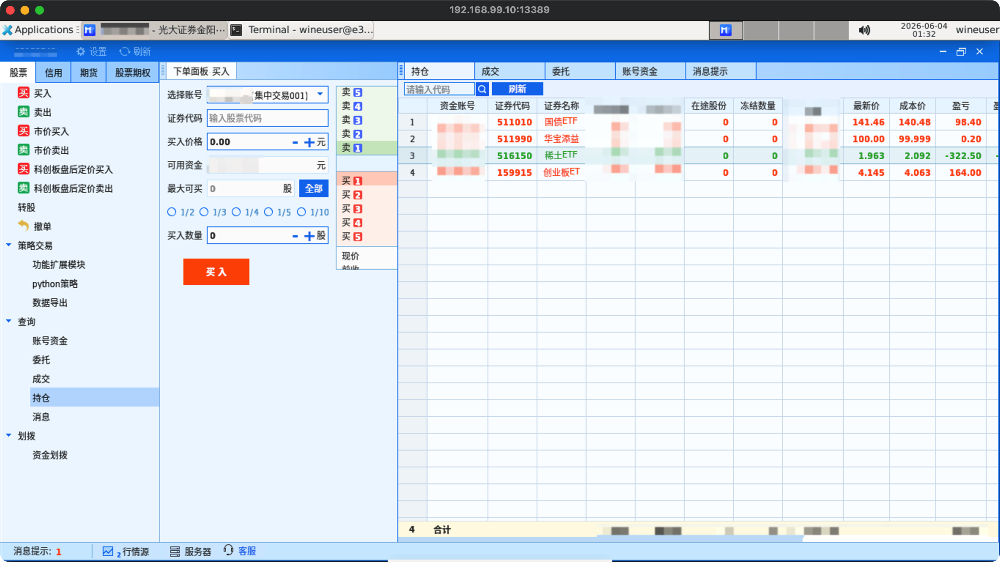

# qmt-mcp · Docker 部署的券商无关 QMT × MCP 网关

🌐 **简体中文** · [English](README.en.md)

[](https://github.com/juju-w/qmt-mcp/actions/workflows/ci.yml)
[](https://github.com/juju-w/qmt-mcp/actions/workflows/release.yml)
[](LICENSE)
[](#)
[](https://github.com/juju-w/qmt-mcp/pkgs/container/qmt-mcp)
[](CONTRIBUTING.md)
[](https://github.com/juju-w/qmt-mcp/stargazers)

用 **Docker** 一键把 Windows 版 **QMT / MiniQMT 终端**（跑在容器内的 Wine 里）封装成
**MCP（Model Context Protocol）** 服务，把 A 股行情与账户能力安全地暴露给 AI Agent。
`docker compose up` 起一个容器，挂上券商 pack 就能用。

> **核心理念**：基础镜像与券商无关，换券商只换一个挂载的 **broker pack**，镜像永不重建。
> 一台机可并行多券商。

```text
不可变基础镜像 ghcr.io/juju-w/qmt-mcp           运行时挂载
(Wine wow64 + Win Python 3.12 + MCP + xrdp)  ◄── broker pack → /broker
—— 券商中立，不含任何终端/xtquant/账户数据         (券商 QMT 终端 + xtquant + broker.yaml)
```

## 截图 / Screenshots

**✨ 合约模糊搜索（核心亮点）** —— AI Agent 用一句中文（"中证500 最好的 ETF"）即可让 MCP
按流动性排序返回候选合约，不必预先知道 QMT 代码：

<p align="center">
  
</p>

| 个股行情快照 | 行业板块成分 | Docker 内 QMT 终端（RDP） |
|:---:|:---:|:---:|
|  |  |  |

## 能力现状

| 能力 | 状态 | 说明 |
|---|---|---|
| 启动 QMT 终端 + RDP 登录 | ✅ | 登录后自动拉起终端 + MCP |
| 行情 `xtdata`（快照/K线/合约/板块/日历） | ✅ 可用 | MCP 工具返回结构化 JSON（11/11 实测通过） |
| **合约模糊搜索**（中文名/拼音/别名/板块/主题） | ✅ 可用 | Agent 不必知道 QMT 代码即可定位合约 |
| 账户查询 / 交易 `xttrader` | ⚠️ 需券商权限 | 未开通时报 `not_authorized` 优雅降级，不崩溃 |

> **交易/账户权限**：外部 `xtquant` 连交易接口（下单**和**账户查询）需券商开通「程序化交易 /
> 外部 Python 接口」权限（`m_nPythonConnectNet`）。未开通时只有行情可用。开通通常需满足
> 资产门槛并签协议，请联系你的券商。

## MCP 工具

✨ **亮点：合约模糊搜索** —— Agent 不必预先知道 QMT 代码，直接用中文名 / 拼音首字母 / 别名 /
板块 / 主题（如 `天岳`、`ZGWX`、`恒生科技`、`纳指`）即可搜到并解析出代码，再去取行情。

| 工具 | 说明 |
|---|---|
| `qmt_health` · `qmt_capabilities` | 健康 / 能力状态（鉴权、依赖、工具族） |
| `qmt_xtdata_search_instruments` ✨ | 按名称/代码/别名/拼音/板块/主题**模糊搜索**合约，带相关性 + 流动性排序 |
| `qmt_xtdata_resolve_instrument` ✨ | 把一句话**解析**成最佳合约代码 + 备选（低置信度返回 `resolved=false`） |
| `qmt_xtdata_search_sectors` | 模糊搜索板块名 |
| `qmt_xtdata_instrument_detail` | 单合约元数据 |
| `qmt_xtdata_snapshot` | 实时快照（最新价 / 买卖盘等） |
| `qmt_xtdata_bars` | K线（tick / 分钟 / 日 / 周 / 月…） |
| `qmt_xtdata_sector_list` · `qmt_xtdata_sector_constituents` | 板块列表 / 成分股 |
| `qmt_xtdata_index_weight` | 指数权重 |
| `qmt_xtdata_trading_dates` · `qmt_xtdata_trading_calendar` · `qmt_xtdata_holidays` | 交易日历 |
| `qmt_xtdata_download_history` · `_batch` | 下载历史数据到本地 |
| `qmt_xtdata_instrument_cache_status` · `qmt_xtdata_refresh_instrument_cache` | 搜索缓存状态 / 刷新 |
| 账户 / 交易 `xttrader`（feature 04） | ⏸ 需券商权限，未开通时 `not_authorized` |

所有工具均为**只读**、带鉴权与审计、返回结构化 JSON（无写/下单工具）。

## 快速开始

> 必须在**原生 amd64 主机**构建运行（Apple Silicon 仅模拟，QMT 可能触发 Rosetta AVX 崩溃）。

```bash
cd appliance
cp .env.example .env                       # 填入 QMT_MCP_TOKEN / BROKER_PACK 等
docker compose build                       # 构建券商中立基础镜像
scripts/make-broker-pack.sh <setup_qmt.exe> <xtquant_xxxxxx.rar> brokers/<id>/pack
docker compose up -d
```

连接（登录 RDP 后在 QMT 里登录资金账号，交易需勾选**独立交易/极简模式**）：

```text
RDP:  <host>:13389   wineuser / 密码见 .env  （用真正的 RDP 客户端，不要用 VNC）
MCP:  http://<host>:18765/mcp   需 Authorization: Bearer <QMT_MCP_TOKEN>
```

更多：[broker pack 制作与切换](appliance/docs/BROKER-PACK.md) ·
[部署与安全加固](appliance/docs/DEPLOY.md)

## ⚠️ 运行要求

- **原生 amd64**：不要在 Apple Silicon 上跑生产（仅模拟，可能触发 Rosetta AVX 崩溃）。
- **GBK 区域**：QMT 是 cp936 中文程序，镜像用 `zh_CN.GBK` 构建 Wine prefix。

## 项目结构与开发

```text
appliance/   # 可部署 appliance：Dockerfile · compose · scripts · mcp/ · brokers/ · docs/
specs/       # Spec-Driven Development（spec-kit）：001~011 规格/计划/任务
```

用 **Spec-Driven Development** 管理，一次一个 feature、先 spec 后实现；原则见
[`constitution.md`](.specify/memory/constitution.md)，AI 协作见 [`AGENT.md`](AGENT.md)，
测试见 [`appliance/mcp/tests/README.md`](appliance/mcp/tests/README.md)。

## 参与贡献 / Help wanted 🙋

最需要社区帮忙的是 **04 账户查询工具（`xttrader` 只读）**：联调"成功路径"需要一个**已开通
「程序化交易 / 外部 Python 接口」权限**（`m_nPythonConnectNet`）的账户，而我自己的账户没有此权限
（达不到券商门槛），只能验证"未授权时优雅降级"。**如果你有已开通权限的账户，欢迎一起把 04 跑通并提
PR** —— 见 [`specs/004`](specs/004-account-query-tools/spec.md)。

其它方向（行情工具、部署示例、文档等）也欢迎 PR。流程见 [`CONTRIBUTING.md`](CONTRIBUTING.md)；
安全问题请按 [`SECURITY.md`](SECURITY.md) 私下报告。

## 赞助支持 ☕

业余时间开发维护，完全开源免费，但开发重度依赖 AI 编程助手（订阅费不便宜 😅）。如果项目帮到你，
欢迎请我喝杯咖啡 / 支持 AI 订阅费——也欢迎点个 ⭐ Star！🙏

| 微信 | 支付宝 |
|:---:|:---:|
|  |  |

## 致谢 / 许可

- 本仓库以 **MIT 许可证**发布（[`LICENSE`](LICENSE)）。
- 本项目的开发大量借助 AI 编程助手 **OpenAI GPT** 与 **Anthropic Claude（Claude Code）**
  加速完成 —— 在此致谢 🤖。
- MCP 工具部分 vendor 自 [`qmt-trade-mcp`](https://github.com/yywx55/qmt-trade-mcp)（MIT，见 `appliance/mcp/NOTICE`）。
- 基础镜像基于 [`scottyhardy/docker-wine`](https://github.com/scottyhardy/docker-wine)。
- QMT 终端、xtquant 归各券商 / 迅投所有，**不含在本仓库**，由使用者自行获取。
