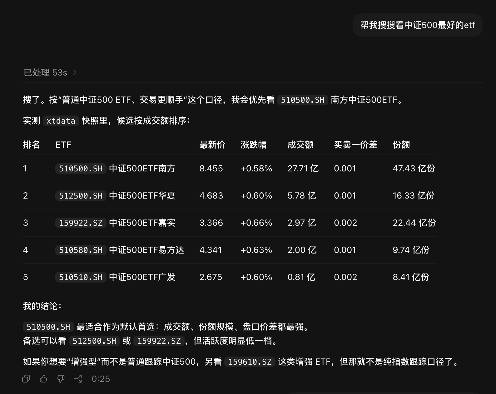
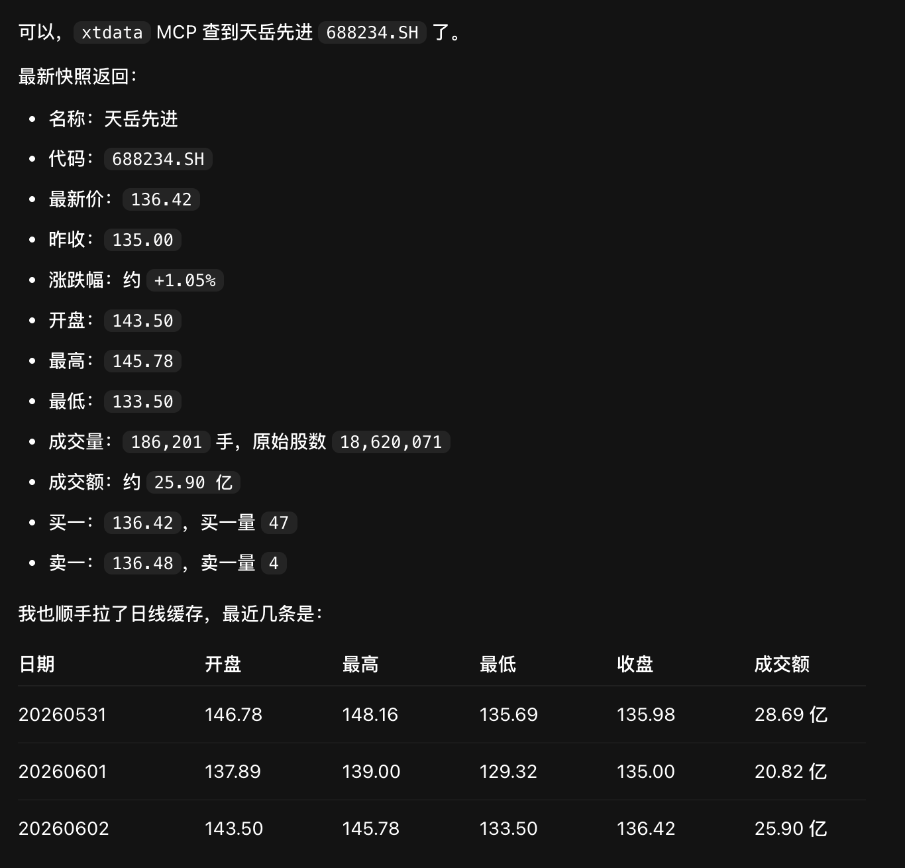
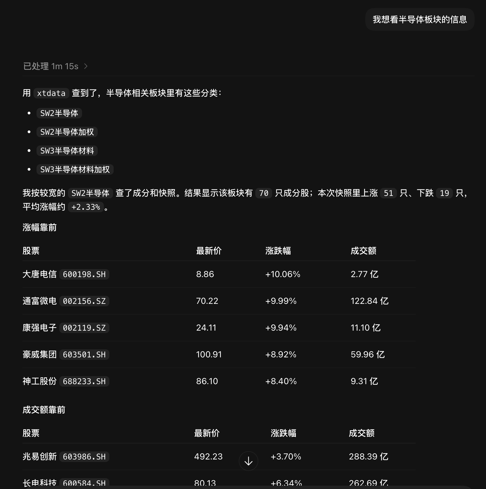
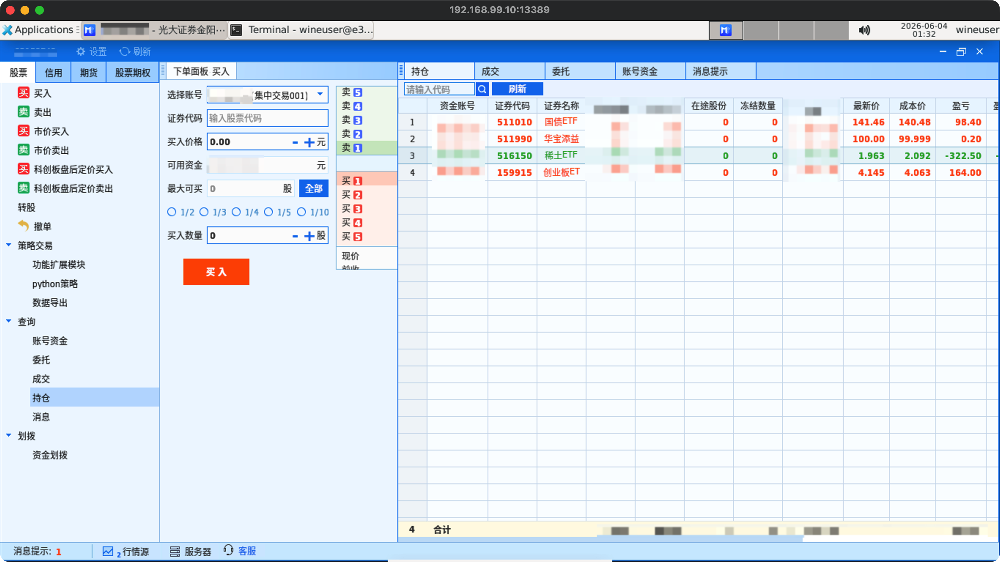

# qmt-mcp · 在 Docker 里跑 QMT，用 MCP 接入 AI Agent

🌐 **简体中文** · [English](README.en.md)

[](https://github.com/juju-w/qmt-mcp/actions/workflows/ci.yml)
[](https://github.com/juju-w/qmt-mcp/actions/workflows/release.yml)
[](LICENSE)
[](#)
[](https://github.com/juju-w/qmt-mcp/pkgs/container/qmt-mcp)
[](CONTRIBUTING.md)
[](https://github.com/juju-w/qmt-mcp/stargazers)

用 **Docker** 一键把 Windows 版 **QMT / MiniQMT 终端**（跑在容器内的 Wine 里）封装成
**MCP（Model Context Protocol）** 服务，把 A 股行情与账户能力安全地暴露给 AI Agent。
`docker compose up` 起一个容器，挂上券商 pack 就能用。

> **核心理念**：基础镜像与券商无关，换券商只换一个挂载的 **broker pack**，镜像永不重建。
> 一台机可并行多券商。

```text
不可变基础镜像 ghcr.io/juju-w/qmt-mcp           运行时挂载
(Wine wow64 + Win Python 3.12 + MCP + xrdp)  ◄── broker pack → /broker
—— 券商中立，不含任何终端/xtquant/账户数据         (券商 QMT 终端 + xtquant + broker.yaml)
```

## 截图 / Screenshots

**✨ 合约模糊搜索（核心亮点）** —— AI Agent 用一句中文（"中证500 最好的 ETF"）即可让 MCP
按流动性排序返回候选合约，不必预先知道 QMT 代码：

<p align="center">
  
</p>

| 个股行情快照 | 行业板块成分 | Docker 内 QMT 终端（RDP） |
|:---:|:---:|:---:|
|  |  |  |

## 能力现状

| 能力 | 状态 | 说明 |
|---|---|---|
| 启动 QMT 终端 + RDP 登录 | ✅ | 登录后自动拉起终端 + MCP |
| 行情 `xtdata`（快照/K线/合约/板块/日历） | ✅ 可用 | MCP 工具返回结构化 JSON（11/11 实测通过） |
| **合约模糊搜索**（中文名/拼音/别名/板块/主题） | ✅ 可用 | Agent 不必知道 QMT 代码即可定位合约 |
| 账户只读查询 `xttrade` | ⚠️ 需券商权限 | 未开通时报 `not_authorized` 优雅降级，不崩溃 |
| 数据库持久化（PostgreSQL，可选） | ✅ 可用 | 行情数据仓库，read/write-through，off by default |
| `qmtctl` CLI | ✅ 可用 | Go 编译命令行客户端，支持行情/搜索/账户查询 |
| MCP 协议 | ✅ 双线兼容 | 主推稳定版 `2026-07-28`，同一 `/mcp` 自动兼容 2025 客户端 |
| MCP 长任务 | ✅ 可用 | 2026 Tasks 持久化执行；未升级或未声明扩展的客户端继续同步调用 |
| MCP 任务多轮输入 | ✅ 可用 | 任务可暂停并分批接收标准 MCP 输入；qmtctl 显式回答，不自动确认 |
| MCP 任务状态通知 | ✅ 可用 | 2026 完整状态推送；qmtctl 通知优先，断流自动轮询回退 |
| MCP 工具契约 / Profile | ✅ 可用 | 结构化结果、行为注解；可按 full/readonly/market/account/core/custom 裁剪工具面 |
| OAuth 2.1 授权 | ✅ 可用 | static/oauth/hybrid；JWT/JWKS 校验、scope 裁剪、qmtctl PKCE 登录与刷新 |

> **交易/账户权限**：外部 `xtquant` 连交易接口（下单**和**账户查询）需券商开通「程序化交易 /
> 外部 Python 接口」权限（`m_nPythonConnectNet`）。未开通时只有行情可用。开通通常需满足
> 资产门槛并签协议，请联系你的券商。

## MCP 工具

✨ **亮点：合约模糊搜索** —— Agent 不必预先知道 QMT 代码，直接用中文名 / 拼音首字母 / 别名 /
板块 / 主题（如 `天岳`、`ZGWX`、`恒生科技`、`纳指`）即可搜到并解析出代码，再去取行情。

| 工具 | 说明 |
|---|---|
| `qmt_health` · `qmt_capabilities` | 健康 / 能力状态（鉴权、依赖、工具族） |
| `qmt_xtdata_search_instruments` ✨ | 按名称/代码/别名/拼音/板块/主题**模糊搜索**合约，带相关性 + 流动性排序 |
| `qmt_xtdata_resolve_instrument` ✨ | 把一句话**解析**成最佳合约代码 + 备选（低置信度返回 `resolved=false`） |
| `qmt_xtdata_search_sectors` | 模糊搜索板块名 |
| `qmt_xtdata_instrument_detail` | 单合约元数据 |
| `qmt_xtdata_snapshot` | 实时快照（最新价 / 买卖盘等） |
| `qmt_xtdata_bars` | K线（tick / 分钟 / 日 / 周 / 月…） |
| `qmt_xtdata_sector_list` · `qmt_xtdata_sector_constituents` | 板块列表 / 成分股 |
| `qmt_xtdata_index_weight` | 指数权重 |
| `qmt_xtdata_trading_dates` · `qmt_xtdata_trading_calendar` · `qmt_xtdata_holidays` | 交易日历 |
| `qmt_xtdata_download_history` · `_batch` | 下载历史数据到本地 |
| `qmt_xtdata_instrument_cache_status` · `qmt_xtdata_refresh_instrument_cache` | 搜索缓存状态 / 刷新 |
| `qmt_xtdata_quote_subscribe` · `qmt_xtdata_quote_unsubscribe` · `qmt_xtdata_quote_subscriptions` · `qmt_xtdata_quote_subscription_status` | 行情订阅热缓存（官方 `subscribe_quote` 优先，轮询兜底） |
| `qmt_xtdata_option_chain` · `qmt_xtdata_option_quotes` · `qmt_xtdata_option_iv` · `qmt_xtdata_volatility_index_inputs` | 期权链/认购认沽报价/IV/VIX 输入包（只读，不发布指数值） |
| `qmt_xtdata_financial_data` · `qmt_xtdata_ipo_info` · `qmt_xtdata_dividend_factors` · `qmt_xtdata_cb_info` · `qmt_xtdata_etf_info` | 财务/新股/分红/可转债/ETF 参考数据（只读，按运行时能力降级） |
| `qmt_portfolio_summary` · `qmt_portfolio_positions` · `qmt_portfolio_exposure` · `qmt_portfolio_risk_checks` | 组合持仓/敞口/风控指标（只读，依赖 xttrade 白名单） |
| `qmt_xtdata_sector_create` · `qmt_xtdata_sector_add_codes` · `qmt_xtdata_sector_remove_codes` · `qmt_xtdata_managed_sector_list` | 自定义板块管理（默认关闭，仅允许 `MCP/`、`AI/` 等受管前缀） |
| `qmt_xtdata_formula_call` · `qmt_xtdata_formula_call_batch` · `qmt_xtdata_formula_generate_factor` · `qmt_xtdata_formula_subscribe` | 公式/因子运行（默认关闭，服务端公式白名单 + 输出目录沙箱） |
| 账户只读查询 `xttrade`（04，**选配**） | 见下表，默认关闭 |

**xttrade 账户查询工具族**（需 `QMT_ENABLE_XTTRADE_QUERY=1` + 账户白名单）：

| 工具 | 说明 |
|---|---|
| `qmt_xttrade_asset` | 资金快照（现金/总值/市值/冻结） |
| `qmt_xttrade_positions` | 持仓列表（代码/数量/可用/冻结/昨仓/在途/开仓价/均价/市值） |
| `qmt_xttrade_orders` | 当日委托（支持 `cancelable_only` 过滤可撤单） |
| `qmt_xttrade_trades` | 当日成交（代码/成交价/量/额/时间/委托号） |
| `qmt_xttrade_position_statistics` | 持仓汇总统计 |
| `qmt_xttrade_account_status` | 账户状态 |
| `qmt_xttrade_new_purchase_limit` | 新股申购额度 |
| `qmt_xttrade_ipo_data` | 当日新股申购信息（非账户维度） |

交易与账户工具均为**只读**、带鉴权与审计、返回结构化 JSON（无下单/撤单/
划转工具）。自定义板块和公式输出是默认关闭的非交易写操作，需显式开关、受管
命名空间/沙箱，以及 OAuth `qmt:manage` 权限。

> **账户查询（feature 04）** 默认关闭，需显式开启 `QMT_ENABLE_XTTRADE_QUERY=1` **且**配置
> 账户白名单 `QMT_TRADE_ACCOUNTS`；且仍需券商开通程序化交易权限才能联调成功路径，未开通时
> 报 `not_authorized` 优雅降级。**纯只读、无下单/撤单/划转**。
> 成功路径待有权限的账户验证（欢迎 PR）。

### 工具契约与 Profile

每个可见工具都发布 `title`、输入/输出 JSON Schema 和只读/破坏性/幂等/
外部访问行为注解。新版客户端直接读取 `structuredContent`；旧客户端仍可读取
语义相同的 JSON 文本块。业务字段不因 schema 校验被增删。

默认 `full` 保持完整工具面。可在 `appliance/.env` 按 Agent 用途缩小上下文和
可调用能力：

```env
QMT_MCP_TOOL_PROFILE=market
QMT_MCP_TOOL_ALLOWLIST=qmt_xtdata_snapshot,qmt_xtdata_option_*
QMT_MCP_TOOL_DENYLIST=qmt_xtdata_download_*
```

支持 `full`、`readonly`、`market`、`account`、`core`、`custom`；`custom`
必须配置 allowlist。模式和 glob 在进程启动时固定，修改后需重启容器。OAuth
模式下它们会再与 token scope 取交集；`qmt:admin` 也不能越过启动 Profile 和
feature gate。

### 工具分页与 HTTP 压缩

`tools/list` 默认每页最多 50 个已授权工具，并用标准 opaque cursor 继续
翻页。Profile、allow/deny 和 OAuth scope 会先裁剪工具面，再生成 cursor；
qmtctl 会自动取完全部页面，所以 `qmtctl tools` 的使用方式和输出不变。
这里分页的是 MCP 工具目录，不会改变行情、期权或参考数据工具各自的 `limit`。

远程 MCP JSON 响应在客户端接受 gzip 且正文至少 1024 字节时自动压缩，SSE
始终不压缩。可在 `appliance/.env` 调整；若反向代理统一负责压缩，可设阈值为
`0` 关闭应用层 gzip：

```env
QMT_MCP_LIST_PAGE_SIZE=50
QMT_MCP_GZIP_MIN_SIZE=1024
```

### 长任务与 MCP Tasks

服务端以稳定版 `2026-07-28` 的 `io.modelcontextprotocol/tasks` 扩展承载下载、
财务数据、批量公式、因子生成和缓存刷新等长操作。声明该扩展的客户端可在断开后
继续查询或取消任务；2025 客户端以及尚未声明 Tasks 的 Codex、Claude Code、
WorkBuddy 等客户端仍走原有同步 `tools/call`，无需升级配置。

任务状态默认持久化到 broker pack 内的 SQLite，只保存生命周期、不可逆 owner
摘要、所需 scope 和终态结果，不保存工具参数、token 或原始用户标识。服务重启
后未完成任务会明确变成 `failed`；终态记录按 TTL 和数量上限清理：

```env
QMT_MCP_TASKS_ENABLED=1
QMT_MCP_TASK_STORE=/broker/cache/mcp-tasks-v1.sqlite3
QMT_MCP_TASK_TTL_MS=86400000
QMT_MCP_TASK_POLL_INTERVAL_MS=1000
QMT_MCP_TASK_MAX_RETAINED=1000
```

长任务可以进入 `input_required`，通过 `tasks/get` 暴露带 `{method, params}`
的标准 `inputRequests`。客户端可分批调用 `tasks/update`；未知、重复或已回答
的键会幂等忽略，最后一个待答键完成后任务恢复。待答问题快照会写入任务库，
回答值只交给当前任务协程，不写 SQLite、日志或审计。服务重启时等待输入的
任务与其他未完成任务一样明确失败，不会重放回答。

声明 Tasks 的 `2026-07-28` 客户端还可通过
`subscriptions/listen.notifications.taskIds` 订阅状态。服务端先返回
`notifications/subscriptions/acknowledged`，随后推送当前状态和每次已落库的
`notifications/tasks` 完整快照。该能力没有新增配置项，也不会发送已删除的
`notifications/tasks/status`。客户端不支持、未确认或连接中断时，继续用
`tasks/get` 即可；qmtctl 默认先尝试通知，再自动回退到服务端指导频率的轮询。

qmtctl 默认等待任务结束并保持原命令输出，也可脱离后续查：

```bash
qmtctl cache refresh --force
qmtctl --task-mode detach --json cache refresh --force
qmtctl task get tsk_<id>
qmtctl task wait tsk_<id>
qmtctl task cancel tsk_<id>
qmtctl task update tsk_<id> \
  --responses-json '{"confirmation":{"action":"accept","content":{"confirm":true}}}'
```

通知与轮询共用同一个 `--task-timeout`。默认等待遇到
`input_required` 时会返回结构化
`task_input_required` 错误，包含 task ID 和待答请求；qmtctl 不会替用户确认。
只有 `2026-07-28` 且声明 Tasks 的客户端启用这些语义，2025 或未声明客户端
仍同步执行。

## 快速开始

> 必须在**原生 amd64 主机**构建运行（Apple Silicon 仅模拟，QMT 可能触发 Rosetta AVX 崩溃）。

```bash
cd appliance
cp .env.example .env                       # 填入认证配置 / BROKER_PACK 等
# 推荐 QMT_DESKTOP_MODE=persistent；RDP 密码至少 12 位且无默认值
docker compose build                       # 构建券商中立基础镜像
scripts/make-broker-pack.sh <setup_qmt.exe> <xtquant_xxxxxx.rar> brokers/<id>/pack
docker compose up -d
```

连接（持久桌面会在容器启动时创建；仍需在 QMT 界面登录资金账号，交易需勾选
**独立交易/极简模式**）：

```text
RDP:  127.0.0.1:13389   wineuser / 密码见 .env  （默认走 SSH/VPN 隧道，不要用 VNC）
MCP:  http://<host>:18765/mcp   需 Authorization: Bearer <QMT_MCP_TOKEN>
```

远程电脑先执行 `ssh -N -L 13389:127.0.0.1:13389 <user>@<host>`，再让
Windows App 连接本机 `127.0.0.1:13389`。断开后重新连接会回到同一个 QMT、
MCP 和 Xorg 会话，不会重复启动终端。

默认 `static` 模式与旧部署完全兼容。公网或多用户场景可切换到外部 OAuth
authorization server 签发 JWT 的 `oauth`/`hybrid` 模式；QMT-MCP 只做 resource
server，不保存用户密码、不签发 token。完整配置和 scope 表见
[客户端接入](docs/MCP-CLIENTS.md) 与 [部署加固](appliance/docs/DEPLOY.md)。

也可以用 **qmtctl** CLI 从命令行操作（详见 [`cli/qmtctl/README.md`](cli/qmtctl/README.md)）：

```bash
cd cli/qmtctl && go build -o qmtctl .
export QMT_MCP_URL=http://<host>:18765/mcp QMT_MCP_TOKEN=<token>
./qmtctl health                       # 健康检查
./qmtctl search 纳指                   # 模糊搜索合约
./qmtctl snapshot 510300.SH           # 实时行情快照
./qmtctl bars 510300.SH --period 1d   # K线数据
./qmtctl subscription add --id s1 510300.SH,510500.SH  # 行情订阅
./qmtctl portfolio summary --account <id>              # 组合概览
./qmtctl option chain --family 300ETF                  # 期权链
./qmtctl ref financial 600000.SH --tables Income       # 参考数据
./qmtctl account asset --account <id> # 账户资产（需开启 xttrade）
```

OAuth 模式可以由 qmtctl 完成浏览器 PKCE 登录并安全复用/刷新会话：

```bash
./qmtctl --url https://qmt.example.com/mcp auth login \
  --client-id-metadata-url https://client.example.com/qmtctl.json \
  --scope 'qmt:read qmt:market'
./qmtctl --url https://qmt.example.com/mcp auth status
```

更多：[broker pack 制作与切换](appliance/docs/BROKER-PACK.md) ·
[部署与安全加固](appliance/docs/DEPLOY.md) ·
[Codex / Claude Code / WorkBuddy 接入](docs/MCP-CLIENTS.md)

## ⚠️ 运行要求

- **原生 amd64**：不要在 Apple Silicon 上跑生产（仅模拟，可能触发 Rosetta AVX 崩溃）。
- **GBK 区域**：QMT 是 cp936 中文程序，镜像用 `zh_CN.GBK` 构建 Wine prefix。

## 项目结构与开发

```text
appliance/   # 可部署 appliance：Dockerfile · compose · scripts · mcp/ · brokers/ · docs/
cli/         # qmtctl：Go 编译的命令行客户端（streamable-http MCP）
skills/      # AI Agent 运维知识库（部署/MCP/CLI/排错）
specs/       # Spec-Driven Development（spec-kit）规格/计划/任务
```

用 **Spec-Driven Development** 管理，一次一个 feature、先 spec 后实现；原则见
[`constitution.md`](.specify/memory/constitution.md)，AI 协作见 [`AGENT.md`](AGENT.md)，
测试见 [`appliance/mcp/tests/README.md`](appliance/mcp/tests/README.md)。

## 版本与自动发布

提交和 PR 标题统一使用 `type(scope): description` 格式，例如
`feat(xtdata): add option filters`、`fix(cli): preserve session headers`。
`main` 的 CI 通过后会按 Conventional Commits 自动计算 SemVer，更新 `VERSION` 和
`CHANGELOG.md`，创建 release commit 与 tag，并发布：

- `ghcr.io/juju-w/qmt-mcp:X.Y.Z` 与 `latest`（appliance 仅 linux/amd64）
- Linux / macOS / Windows 的 qmtctl（amd64 + arm64）
- `SHA256SUMS` 和 GitHub Release

镜像使用持久 BuildKit cache；普通 MCP 源码变更不会重新安装 Wine 和 Windows
Python 依赖。也可以配置阿里云 ACR 等国内仓库，CI 会复制同一个镜像 digest，
不会二次构建。详细规则、国内镜像变量和旧 tag 重试方法见
[`docs/RELEASE.md`](docs/RELEASE.md)，版本增量映射见
[`CONTRIBUTING.md`](CONTRIBUTING.md)。

## 参与贡献 / Help wanted 🙋

最需要社区帮忙的是 **04 账户查询工具（`xttrade` 只读）**：联调"成功路径"需要一个**已开通
「程序化交易 / 外部 Python 接口」权限**（`m_nPythonConnectNet`）的账户，而我自己的账户没有此权限
（达不到券商门槛），只能验证"未授权时优雅降级"。**如果你有已开通权限的账户，欢迎一起把 04 跑通并提
PR** —— 见 [`specs/004`](specs/004-account-query-tools/spec.md)。

其它方向（行情工具、部署示例、文档等）也欢迎 PR。流程见 [`CONTRIBUTING.md`](CONTRIBUTING.md)；
安全问题请按 [`SECURITY.md`](SECURITY.md) 私下报告。

## 赞助支持 ☕

业余时间开发维护，完全开源免费，但开发重度依赖 AI 编程助手（订阅费不便宜 😅）。如果项目帮到你，
欢迎请我喝杯咖啡 / 支持 AI 订阅费——也欢迎点个 ⭐ Star！🙏

| 微信 | 支付宝 |
|:---:|:---:|
|  |  |

## 致谢 / 许可

- 本仓库以 **MIT 许可证**发布（[`LICENSE`](LICENSE)）。
- 本项目的开发大量借助 AI 编程助手 **OpenAI GPT / Codex** 与 **Anthropic Claude（Claude Code）**
  加速完成 —— 在此致谢 🤖。
- MCP 服务为本仓库独立实现（`appliance/mcp/qmt_mcp_core` + `qmt_mcp_xtdata` + `qmt_mcp_xttrade` + `qmt_mcp_db`）。
- 基础镜像基于 [`scottyhardy/docker-wine`](https://github.com/scottyhardy/docker-wine)。
- QMT 终端、xtquant 归各券商 / 迅投所有，**不含在本仓库**，由使用者自行获取。
